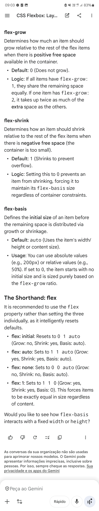

@ WEB FLEXBOX

- flex-direction: axis? values?
- align-content vs justify-content
- align-items vs align-content
- flex-grow flex-shrink flex-basis

The Core Concept
CSS Flexbox (Flexible Box Layout) is a one-dimensional layout model. It manages space distribution and alignment between items in an interface, even when their size is unknown or dynamic. It operates on a Parent (Flex Container) and Child (Flex Items) relationship.
The Flex Container
To activate flexbox, apply display: flex; or display: inline-flex; to an element.
 * flex-direction: Defines the main axis (row, row-reverse, column, column-reverse).
 * justify-content: Aligns items along the main axis (e.g., center, space-between, flex-end).
 * align-items: Aligns items along the cross axis (e.g., stretch, center, baseline).
 * flex-wrap: Controls whether items stay on one line or wrap onto multiple lines.
 * gap: Defines the gutter space between items without needing margins.
The Flex Items
These properties are applied directly to the children of the container.
 * flex-grow: Defines the ability for an item to grow if necessary. It accepts a unitless value that serves as a proportion.
 * flex-shrink: Defines the ability for an item to shrink when there isn't enough space.
 * flex-basis: Sets the initial main size of an item before remaining space is distributed.
 * flex: A shorthand for flex-grow, flex-shrink, and flex-basis combined.
 * align-self: Overrides the container's align-items value for a specific individual item.
 * order: Controls the visual order of items regardless of their position in the HTML source.
The Axes
Flexbox works with two axes:
 * Main Axis: Determined by flex-direction. If direction is row, the axis is horizontal.
 * Cross Axis: Runs perpendicular to the main axis. If direction is row, the axis is vertical.
Would you like me to write a code snippet for a specific layout, like a centered hero section or a navigation bar?

The Distinction
The difference lies in how many lines of content you are aligning.
align-items (The Single-Line Controller)
This property works on every individual row within the container. It aligns the items relative to their specific line's cross-axis.
 * Scope: Works on single-line and multi-line containers.
 * Behavior: If you have three items in one row, align-items: center moves those items to the middle of that specific row.
align-content (The Multi-Line Controller)
This property aligns the entire structure of rows within the container. It only has an effect when there is extra space in the cross-axis and items are wrapping.
 * Requirement: Only works when flex-wrap is set to wrap or wrap-reverse.
 * Behavior: If your items wrap into three rows, align-content: center bunched those three rows together in the middle of the container, ignoring the individual line heights.
Comparison at a Glance
 * align-items: Controls how items sit inside their current line. Think of it as "vertical alignment for the row."
 * align-content: Controls the spacing between the lines themselves. Think of it as "justify-content for the cross-axis."
> Note: If flex-wrap: nowrap is active (the default), align-content does absolutely nothing because there is only one line to align.
> 
Would you like a code example showing a container where both properties are used simultaneously to see the interaction?
