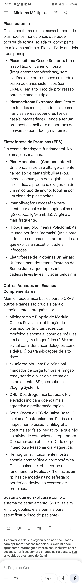

@ MIELOMA MÚLTIPLO

CRITÉRIOS 
- > 10% de plasmócitos clonais na ... ou plasmocitoma
CRAB
- 11
- 2/40
- < 10 ou -2
- Lesões líticas 
BIOMARCADORES
- > ...% de plasmócitos clonais na medula
- Relação entre... > 100
- 2 ou mais lesões > 5 ...

COMPLEMENTARES 
- Lesões osteoclasticas (PET negativo)
- Bence Jones
- Plasmocitoma mais comum em vias aéreas superiores 
ESFREGAÇO 
- Rouleaux = Pilha de moedas 
- Corpusculos de Russell, Dutcher, células de Mott (citoplasma em cacho de uva)
- Fundo corado no azul de metileno
- Células em flama = IgA
HIPERVISCOSIDADE
- Ig relacionada
- Medida terapêutica mais eficaz
- Hemostasia 
- Fundo do olho com vasculatura em salsicha
- Ouvido

