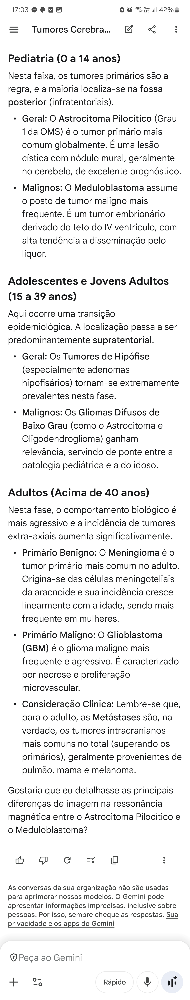

@ TUMORES SNC

- Benigno mais comum em adolescentes e jovens adultos
- Foster-Kennedy = Atrofia do n. optico ipsilateral + Papiledema contralateral + Anosmia ipsilateral = Meningioma de goteira nasal
GLIOBLASTOMA DE BAIXO GRAU (OMS 2)
- Clínica mais frequente
GLIOBLASTOMA DE ALTO GRAU / ASTROCITOMA IDH-MUTANTE (OMS 4)
- Faixa etária típica 
- Tipo de edema na imagem 
- Relação com a linha média (corpo caloso)
ASTROCITOMA PILOCÍTICO (OMS Grau 1)
- Faixa etária 
- Imagem
- Localização 
- Prognóstico 
MENINGIOMA
- Imagem
- Clínica 
- Relação com sexo
MEDULOBLASTOMA
- Faixa etária 
- Localização 
- Disseminação 

- Benigno mais comum em adolescentes e jovens adultos = Adenoma de hipófise 
- Foster-Kennedy = Atrofia do n. optico ipsilateral + Papiledema contralateral + Anosmia ipsilateral = Meningioma de goteira nasal
GLIOBLASTOMA DE BAIXO GRAU (OMS 2)
- Clínica mais frequente = Convulsão sem achados focais persistentes 
GLIOBLASTOMA DE ALTO GRAU / ASTROCITOMA IDH-MUTANTE (OMS 4)
- Faixa etária típica = Idosos
- Tipo de edema na imagem = Em dedos de luva, respeitando sulcos e substância cinzenta
- Relação com a linha média (corpo caloso) = Não respeita = "Em asa de borboleta"
ASTROCITOMA PILOCÍTICO (OMS Grau 1)
- Faixa etária = Crianças 
- Imagem = Cisto com nódulo mural
- Localização = Cerebelo
- Prognóstico = Bom
MENINGIOMA
- Imagem = Cauda dural (+ base larga + fenda de liquor + realce intenso)
- Clínica = Compressiva (esp. pares cranianos e paresia inferior) 
- Relação com sexo = Mais comum no feminino pois é hormônio dependente
MEDULOBLASTOMA
- Faixa etária = Crianças 
- Localização = Teto do 4° ventrículo 
- Disseminação = Por gotejamento

