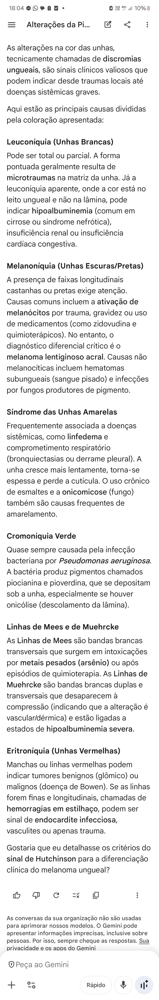
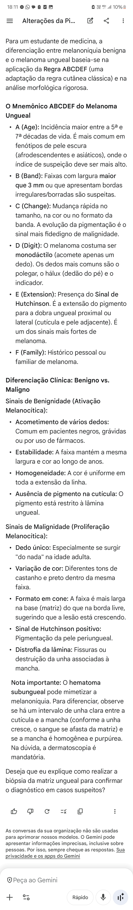

@ DISCROMIAS. UNGUEAIS

@ MELANONÍQUIA MELANOMA DE UNHA MELANOMA UNGUEAL

SINAIS DE MALIGNIDADE 
- Largura > ... mm
- Quantidade de dedos acometidos 
- Sinal de Hutchinson 
- Base [maior/menor] ponta

