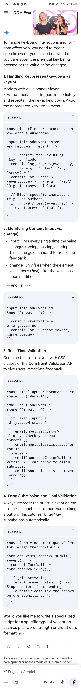

@ WEB EVENTS ADDEVENTLISTENER KEYPRESS VALIDATION INPUT DONE0

- Nome do evento preferencial para apertar botão (esp. se quer repetir se manter pressionado)
- event.key vs event.code
- Como bloquear que um keypress vá para um input?
- Event input vs change
- How to intercept a form submission (event, code)

