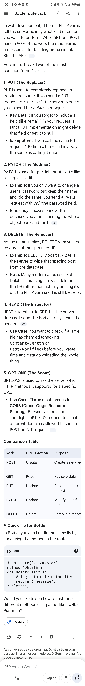

.

@@0001

- bottle.run parameters for development
    - run(host='localhost', port=8080, debug=True, reloader=True)
- @bottle.route vs @bottle.get
    - route need request.method == "VERB"
- What is necessary in <form> attributes?
    - <form action="/login" method="post"> 
- // in forms' input and submit button?
    - <input name="username" type="text" />
    - <button type="submit">
- How to obtain the data sent by the forms?
    - ⎵⎵⎵.forms.⎵⎵⎵('username')
        - request.forms.get
- bottle.template parameters
    - template('index', name='User')
    - index.tpl in ./views
- How to receive data as URL queries?
    - @route('/greet/<name>')
- Regex and custom filters (where to register them?)
- bottle.static_file parameters
    - static_file(filename, ⎵⎵⎵='/path/to/your/files')
        - root
- templating language comments, if/else, for loop, ternary
- {{}} vs {{!}}
- {{!base}}, rebase parameters, include parameters
    - rebase('layout', title='Home Page')
    - include('footer_component', year=2026)

from bottle import route, run

@route('/hello')
def hello():
    return "Hello World!"

run(host='localhost', port=8080)

@route('/greet/<name>')
def greet(name):
    return f"Hello {name}, welcome back!"

from bottle import get, post, request

@get('/login')
def login_form():
    return '''
        <form action="/login" method="post">
            Username: <input name="username" type="text" />
            <button type="submit">Login</button>
        </form>
    '''

@post('/login')
def do_login():
    username = request.forms.get('username')
    return f"Logging in as {username}..."

from bottle import template
@route('/')
def index():
    return template('index', name='User')

from bottle import static_file
@route('/static/<filename>')
def server_static(filename):
    return static_file(filename, root='/path/to/your/files')

run(host='localhost', port=8080, debug=True, reloader=True)

% # This is index.tpl
<h1>Welcome, {{name.title()}}!</h1>

% if items:
  <ul>
  % for item in items:
    <li>{{item}}</li>
  % end
  </ul>
% else:
  
The list is empty.

% end

from bottle import route, template

@route('/inventory')
def show_list():
    items_list = ['Apples', 'Bananas', 'Coffee']
    return template('index', name='guest', items=items_list)

<html>
<head><title>{{title or 'My Site'}}</title></head>
<body>
  {{!base}}
</body>
</html>
(layout.tpl)

% rebase('layout', title='Home Page')

This is the main content of the page.

% include('footer_component')
(index.tpl)

@route('/info')
def info():
    tpl = "Current user: {{user}}"
    return template(tpl, user='Admin')

<footer>
    
&copy; 2026 My Bottle App. All rights reserved.

    <ul>
        <li><a href="/contact">Contact Us</a></li>
        <li><a href="/privacy">Privacy Policy</a></li>
    </ul>
</footer>
(footer_component.tpl)

% include('footer_component', year=2026)

from bottle import route

# Matches a 3-digit area code followed by a 7-digit number
@route('/phone/<number:re:\d{3}-\d{7}>')
def call_number(number):
    return f"Calling {number}..."

# Matches a username that must be lowercase letters, 3-10 chars long
@route('/profile/<name:re:[a-z]{3,10}>')
def show_profile(name):
    return f"Welcome, {name}"

from bottle import route, app, run

# 1. Define the filter logic
def uuid_filter(config):
    # The regex for a standard UUID
    regexp = r'[0-9a-f]{8}-[0-9a-f]{4}-[0-9a-f]{4}-[0-9a-f]{4}-[0-9a-f]{12}'
    
    def to_python(value):
        return value.upper() # Transform it however you like
        
    def to_url(value):
        return value

    return regexp, to_python, to_url

# 2. Register the filter with the app
app = app()
app.router.add_filter('uuid', uuid_filter)

# 3. Use it in a route
@route('/order/<id:uuid>')
def show_order(id):
    return f"Order ID: {id}" # 'id' is already uppercase here

