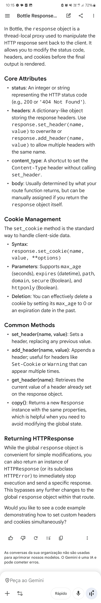
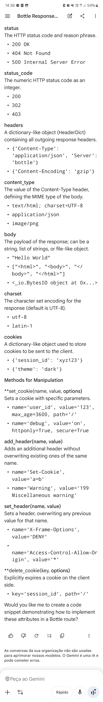
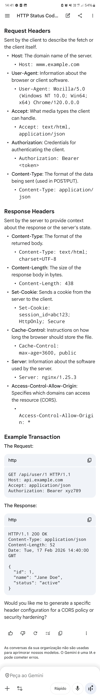
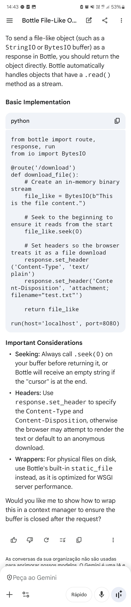
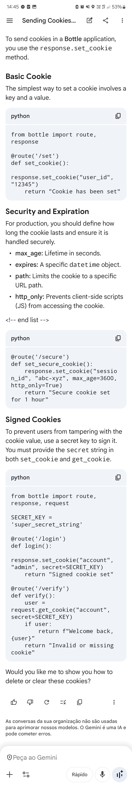

@@0001 

from bottle import route, response, run
from io import BytesIO

@route('/download')
def download_file():
    # Create an in-memory binary stream
    file_like = BytesIO(b"This is the file content.")
    
    # Seek to the beginning to ensure it reads from the start
    file_like.seek(0)
    
    # Set headers so the browser treats it as a file download
    response.set_header('Content-Type', 'text/plain')
    response.set_header('Content-Disposition', 'attachment; filename="test.txt"')
    
    return file_like

run(host='localhost', port=8080)

@route('/secure')
def set_secure_cookie():
    response.set_cookie("session_id", "abc-xyz", max_age=3600, http_only=True)
    return "Secure cookie set for 1 hour"

from bottle import route, response, request

SECRET_KEY = 'super_secret_string'

@route('/login')
def login():
    response.set_cookie("account", "admin", secret=SECRET_KEY)
    return "Signed cookie set"

@route('/verify')
def verify():
    user = request.get_cookie("account", secret=SECRET_KEY)
    if user:
        return f"Welcome back, {user}"
    return "Invalid or missing cookie"
 