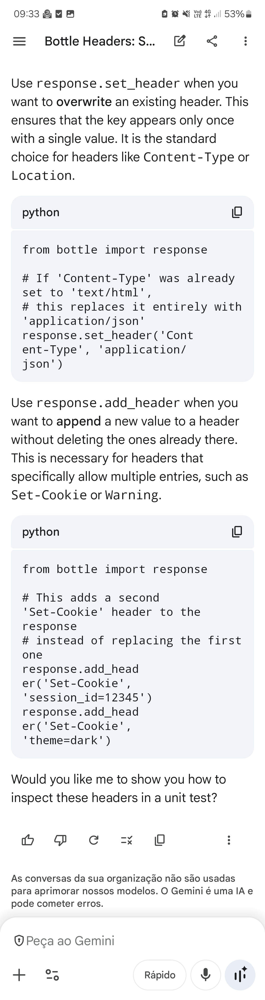
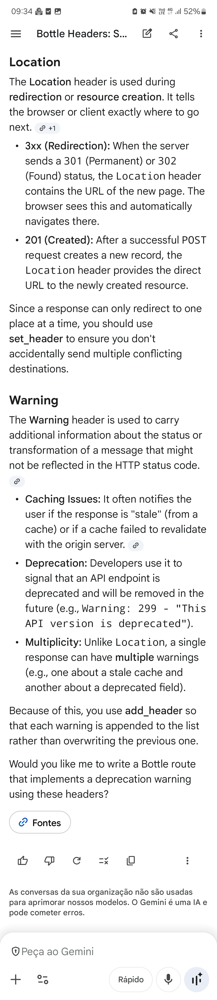
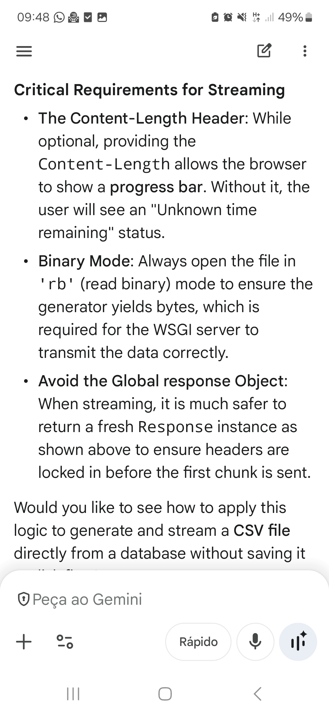
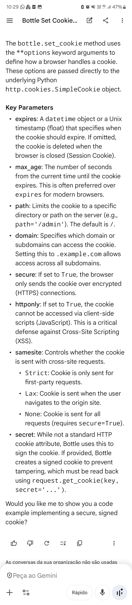

@@0001 

bottle.response ATTRIBUTES 
- An integer or string represeting the HTTP status code
- A dictionary-like object storing response headers
    - ... to overwrite (e.g. Content-Type application/json)
        - response.set_header(name, value)
    - ... to allow multiple with the same name (e.g. Set-Cookie session_id=abc123)
        - response.add_header(name, value)
- A shortcut to set_header("Content-Type", value)
bottle.set_cookie(name, value, **options) OPTIONS
- max_age vs expires

from bottle import route, response, run
from io import BytesIO

@route('/download')
def download_file():
    # Create an in-memory binary stream
    file_like = BytesIO(b"This is the file content.")
    
    # Seek to the beginning to ensure it reads from the start
    file_like.seek(0)
    
    # Set headers so the browser treats it as a file download
    response.set_header('Content-Type', 'text/plain')
    response.set_header('Content-Disposition', 'attachment; filename="test.txt"')
    
    return file_like

run(host='localhost', port=8080)

@route('/secure')
def set_secure_cookie():
    response.set_cookie("session_id", "abc-xyz", max_age=3600, http_only=True)
    return "Secure cookie set for 1 hour"

from bottle import route, response, request

SECRET_KEY = 'super_secret_string'

@route('/login')
def login():
    response.set_cookie("account", "admin", secret=SECRET_KEY)
    return "Signed cookie set"

@route('/verify')
def verify():
    user = request.get_cookie("account", secret=SECRET_KEY)
    if user:
        return f"Welcome back, {user}"
    return "Invalid or missing cookie"
    

 

Why use Response over static_file?
​While Bottle has a built-in static_file helper, using the Response object is necessary when the file content is generated in memory (like a dynamically created CSV or a ZIP generated on the fly) rather than sitting on the disk.

import os
from bottle import route, Response

@route('/stream-large-file')
def stream_file():
    path = 'very_large_database_export.sql'
    
    def chunk_generator():
        with open(path, 'rb') as f:
            while True:
                chunk = f.read(1024 * 1024) # Read 1MB chunks
                if not chunk:
                    break
                yield chunk

    headers = {
        'Content-Type': 'application/octet-stream',
        'Content-Disposition': f'attachment; filename="{os.path.basename(path)}"',
        'Content-Length': str(os.path.getsize(path))
    }

    return Response(chunk_generator(), **headers)

