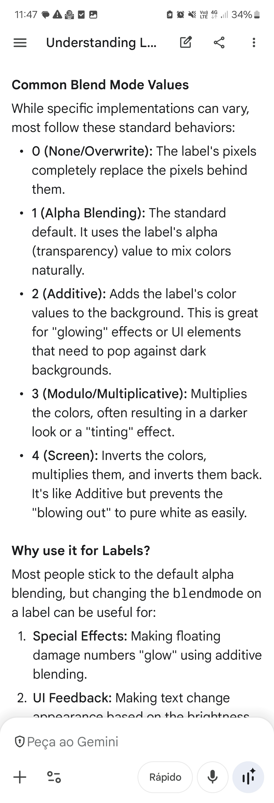
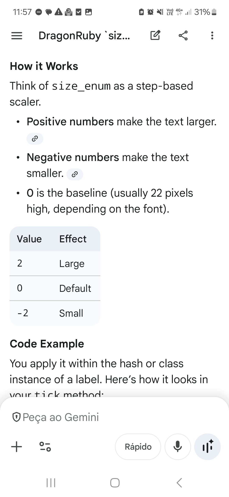
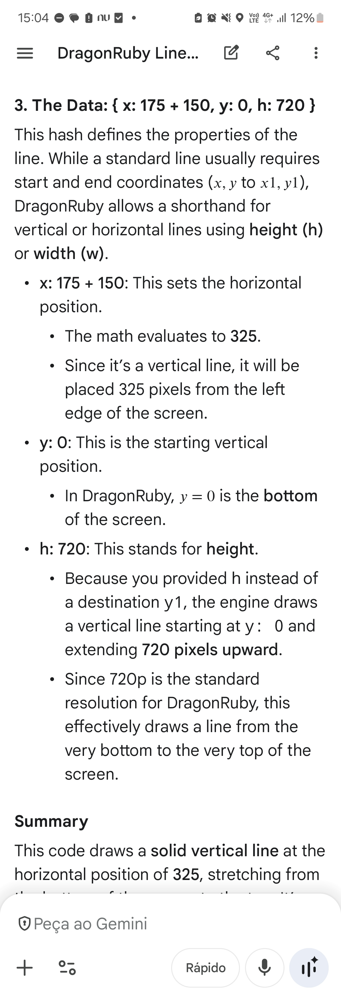
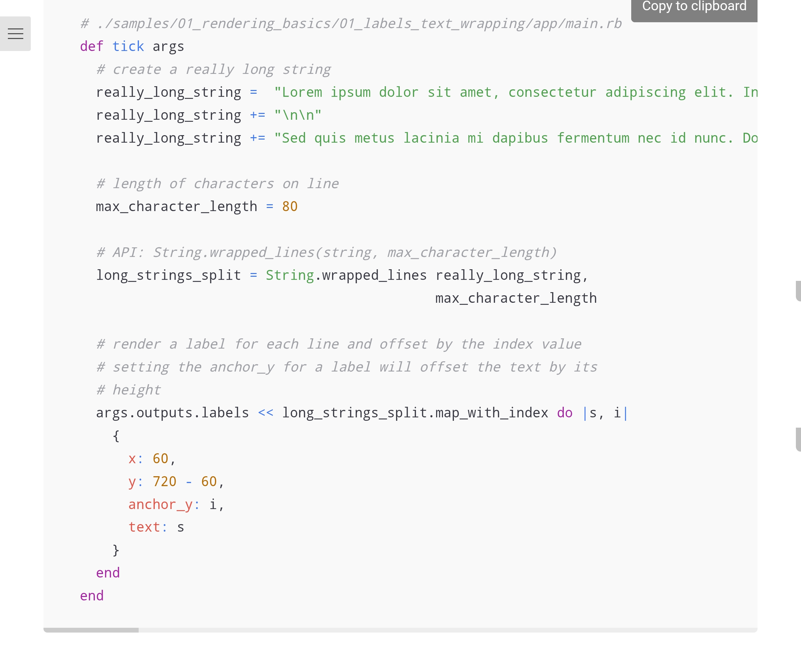

@@0001

args.outputs.labels << { x: 320,
  y: 640,
  text: "Text",
  font: "fonts/font.ttf",
  anchor_x: 0.5,
  anchor_y: 0.5,
  r: 0,
  g: 0,
  b: 0,
  a: 255,
  size_px: 20,
  blendmode: 1 }
  
args.outputs.labels << 
    { x: 690 + 150,
    y: 330 - 50,
    text: "Custom font (Hash)",
    size_enum: 0,
    alignment_enum: 1,
    vertical_alignment_enum: 2,
    equivalent to anchor_y: 1,
    r: 125,
    g: 0,
    b: 200,
    a: 255,
    font: "manaspc.ttf"
}

(use args.outputs.primitives with the same args and it just works)
 

args.outputs.labels << [640, 650, "frame: #{Kernel.tick_count}"]

width, height = args.gtk.calcstringbox("Hello World", 0, "font.ttf")

def tick args
  label_text = "Click Me!"
  size = 2
  
  # 1. Calculate the size
  w, h = args.gtk.calcstringbox(label_text, size)

  # 2. Draw a border based on that size (with a little padding)
  args.outputs.borders << { x: 100, y: 100, w: w + 20, h: h + 20 }
  
  # 3. Draw the label inside
  args.outputs.labels << { x: 110, y: 110 + h, text: label_text, size_enum: size }
end

(test label anchors from samples)

Kernel.tick_count

path: or primitive_marker: :solid or :border
sprites: path: and angle:
angle_anchor_x: and y
flip_horizontally and vertically (true or false)