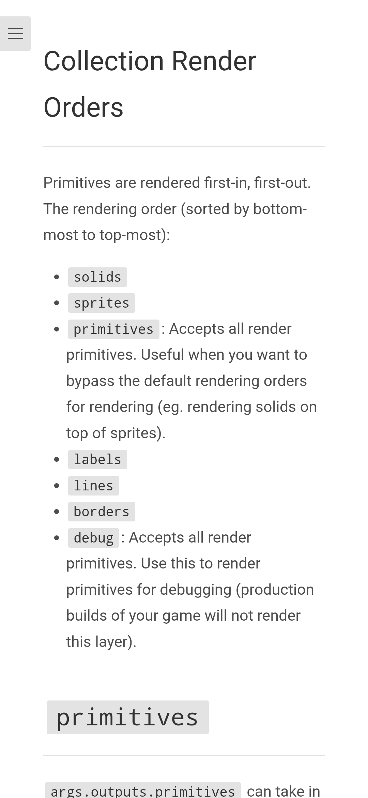
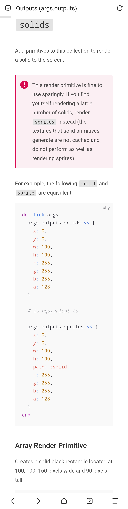
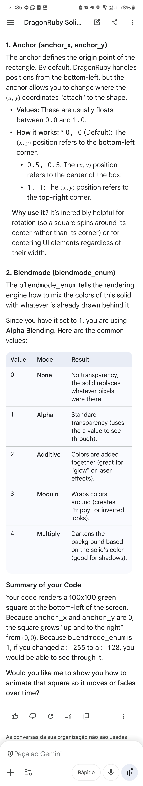

- Getter and setters in mRuby
- Inheritance in mRuby
- Definitions in mRuby
- Rendering labels, sprites, line (primitive), solids
- Background color
- Hash vs Array notation
- String and Watch debug
- Rotate a sprite
- Reading a mouse click @@0001 

def tick args
  args.outputs.labels << [580, 400, 'Hello World!']
end

def tick args
  args.outputs.labels  << [580, 400, 'Hello World!']
  args.outputs.sprites << [576, 100, 128, 101, 'dragonruby.png']
end

def tick args
  args.state.rotation  ||= 0
  args.outputs.labels  << [580, 400, 'Hello World!' ]
  args.outputs.sprites << [576, 100, 128, 101, 'dragonruby.png', args.state.rotation]
  args.state.rotation  -= 1
end

  if args.inputs.mouse.click
    args.state.x = args.inputs.mouse.click.point.x - 64
    args.state.y = args.inputs.mouse.click.point.y - 50
  end
 
def tick args
  args.outputs.solids     << { x: 0, y: 0, w: 100, h: 100 }
  args.outputs.sprites    << { x: 100, y: 100, w: 100, h: 100, path: "sprites/square/blue.png" }
  args.outputs.labels     << { x: 200, y: 200, text: "Hello World" }
  args.outputs.borders    << { x: 0, y: 0, w: 100, h: 100 }
  args.outputs.lines      << { x: 300, y: 300, x2: 400, y2: 400 }
end

(use primitives to render things out of order)

def tick args
  # sprite
  args.outputs.primitives << { x: 100, y: 100,
                               w: 100, h: 100,
                               path: "sprites/square/blue.png" }

  # solid
  args.outputs.primitives << { x: 0,
                               y: 0,
                               w: 100,
                               h: 100,
                               primitive_marker: :solid }

  # border
  args.outputs.primitives << { x: 0,
                               y: 0,
                               w: 100,
                               h: 100,
                               primitive_marker: :border }

  # label
  args.outputs.primitives << { x: 100, y: 100,
                               text: "hello world" }

  # line
  args.outputs.primitives << { x: 100, y: 100, x2: 150, y2: 150 }
end

def tick args
  # sets the background color to red
  args.outputs.background_color = [255, 0, 0]

  # OR
  args.outputs.background_color = { r: 255, g: 0, b: 0 }
end

debug does not render in production

args.outputs.debug << "current tick: #{Kernel.tick_count}"
  args.outputs.debug << "player x: #{args.state.player.x}"
  args.outputs.debug << "hello\nworld"
 
(handles styling automatically)

  args.outputs.debug.watch args.state.player
  args.outputs.debug.watch pretty_format(args.state.player),
                           label_style: { r: 0,
                                          g: 0,
                                          b: 255,
                                          size_px: 10 },
                           background_style: { r: 0,
                                               g: 255,
                                               b: 0,
                                               a: 128,
                                               path: :solid }

(for debuging complex objects) @try

def tick args
  #                         X    Y  WIDTH  HEIGHT
  args.outputs.solids << [100, 100,   160,     90]
end

def tick args
  #                         X    Y  WIDTH  HEIGHT  RED  GREEN  BLUE  ALPHA
  args.outputs.solids << [100, 100,   160,     90,   0,   255,    0,   128]
end

def tick args
  args.outputs.solids << {
    x:    0,
    y:    0,
    w:  100,
    h:  100,
    r:    0,
    g:  255,
    b:    0,
    a:  255,
    anchor_x: 0,
    anchor_y: 0,
    blendmode_enum: 1
  }
end

# Create type with ALL solid properties AND primitive_marker
class Solid
  attr_accessor :x, :y, :w, :h, :r, :g, :b, :a, :anchor_x, :anchor_y, :blendmode_enum

  def primitive_marker
    :solid # or :border
  end
end

# Inherit from type
class Square < Solid
  # constructor
  def initialize x, y, size
    self.x = x
    self.y = y
    self.w = size
    self.h = size
  end
end

def tick args
  # render solid/border
  args.outputs.solids  << Square.new(10, 10, 32)
end

# Create type with ALL solid properties AND primitive_marker
class Solid
  attr_accessor :x, :y, :w, :h, :r, :g, :b, :a, :anchor_x, :anchor_y, :blendmode_enum

  def primitive_marker
    :solid # or :border
  end
end

# Inherit from type
class Square < Solid
  # constructor
  def initialize x, y, size
    self.x = x
    self.y = y
    self.w = size
    self.h = size
  end
end

def tick args
  # render solid/border
  args.outputs.solids  << Square.new(10, 10, 32)
end
