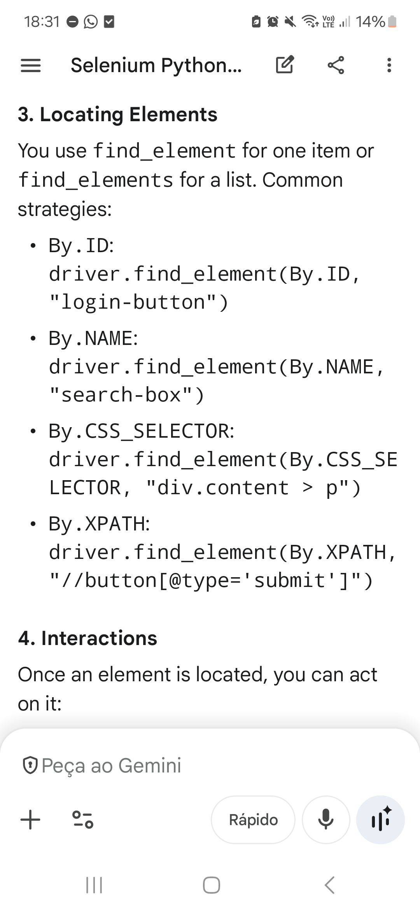

.

@@0001

- from ⎵⎵⎵ import webdriver
    - selenium
- from selenium.webdriver.⎵⎵⎵.service import Service
    - chrome
- from selenium.webdriver.⎵⎵⎵.by import By
    - common
- from selenium.webdriver.⎵⎵⎵.keys import Keys
    - common
- driver = ⎵⎵⎵.Chrome()
    - webdriver
- driver.⎵⎵⎵("https://www.google.com")
    - get
- driver.quit()
- By.⎵⎵⎵ .
    - ID
        - By.ID
    - Name
        - By.NAME
    - CSS selector
        - By.CSS_SELECTOR
    - XPath
        - By.XPATH
- Interactions
    - Typing
        - e.send_keys(str)
    - Clicking
        - e.click()
    - Clearing text
        - e.clear()
    - Pressing enter
        - e.send_keys(⎵⎵⎵.RETURN)
            - Keys
- from selenium.webdriver.⎵⎵⎵.ui import WebDriverWait
    - support
- from selenium.webdriver.⎵⎵⎵ import expected_conditions as EC
    - support
- element = WebDriverWait(⎵⎵⎵, 10).until(⎵⎵⎵.presence_of_element_located((By.ID, "dynamic-content")))
    - driver 
    - EC (expected_conditions)
- from selenium.webdriver.⎵⎵⎵.options import Options
    - chrome
- options = ⎵⎵⎵()
    - Options
- options.add_argument("--headless")
- driver = webdriver.Chrome(options=options)

 
