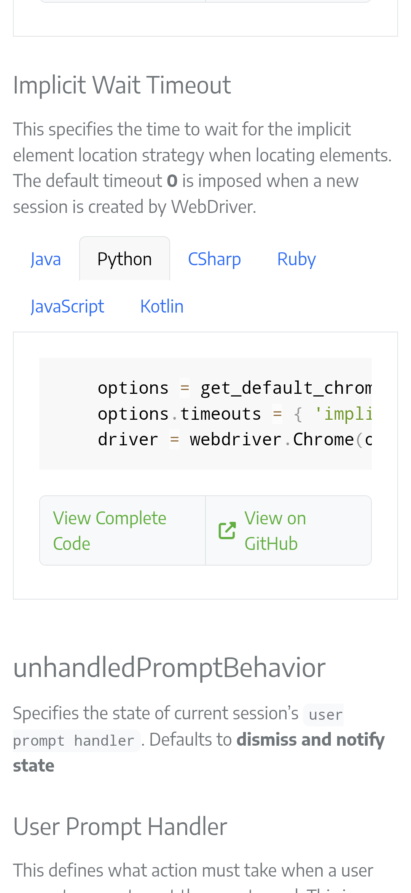

- webdriver creation
- url selection
- driver quitting
- Implicit vs Explicit waiting strategy
- implicit waiting
- finding elements
- enter input 
- text x textContent x innerHTML x innerText
- set page load strategy and global implicit waits

from selenium import webdriver

driver = webdriver.Chrome()

driver.get("http://selenium.dev")

driver.quit()

title = driver.title

driver.implicitly_wait(0.5)

text_box = driver.find_element(by=By.NAME, value="my-text")
submit_button = driver.find_element(by=By.CSS_SELECTOR, value="button")

text_box.send_keys("Selenium")
submit_button.click()

message = driver.find_element(by=By.ID, value="message")
text = message.text

driver.quit()

pytest path/to/test_script.py

    options = get_default_chrome_options()
    options.page_load_strategy = 'normal'
    driver = webdriver.Chrome(options=options)

    options = get_default_chrome_options()
    options.timeouts = { 'implicit': 5000 }
    driver = webdriver.Chrome(options=options)

    wait = WebDriverWait(driver, timeout=2)
    wait.until(lambda _ : revealed.is_displayed())
(Explicit wait strategy)
(Do not mix with implicit wait)