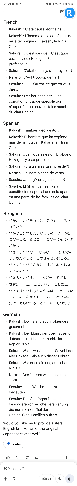

.

@@@0001

JAPONÊS 
- 記す
しるす
    - to be written down
- にしろ
    - (particle for listing examples)
    - things such as X and Y...
- どういう　ことだ 
    - What the heck
- 一部の家系 いちぶのかけい
    - One from the clan
    - Part of the clan
- 特異体質 とくいたいしつ
    - Idiosyncrassy
ALEMÃO 
- unglaublicher 
    - Amazing
- Was hat das zu bedeuten?
    - What does that mean?
- Das Sharingan ist... eine besondere körperliche Veranlagung, die nur in einem **Teil** der Uchiha-Clan-Familien auftritt.
    - Part

