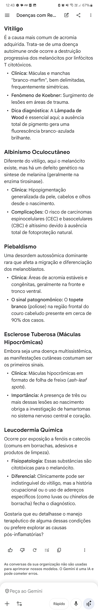
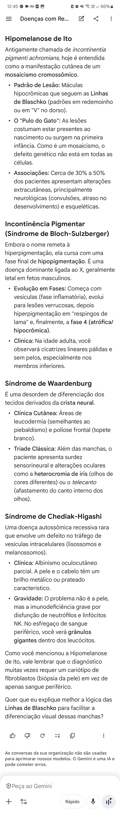

@0000

VITILIGO 
- Wood
PIEBALDISMO = ...ose
ESCLEROSE TUBEROSA = Manchas em folhas de...
- 3 ou mais ao nascer indica pesquisa de ...tomas em SNC e coração 
LEUCODERMIA QUÍMICA 
- Borracha, adesivo, cola, limpeza são os principais culpados (fenóis e catecol)
HIPOMELANOSE DE ITO = Mosaicismo
- Lesões em V no dorso ou em redemoinho
WAARDENBURG = Do espectro do piebaldismo 
- Surdez ... [tipo] + ...mia de íris + ...canto
CHEDIAK-HIGASHI = Albinismo com cabelo prateado + Imunodeficiência grave

