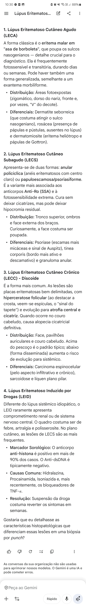
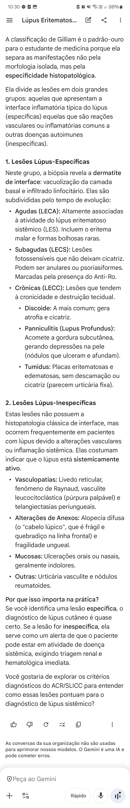
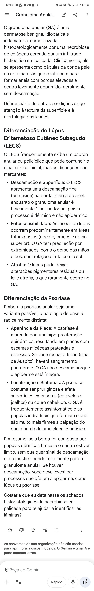

.

@0003

- LECA (Rash malar) x Rosacea/Dermatite = Sulco nasogeniano?
    - O lúpus poupa 
- LECS (Subagudo) = Anular policíclico x Psoriasiforme = Muito fotoreativo + Poupa face + Anti-Ro (SSA) positivo
    - Na psoríase, as escamas são mais ...antes e [aderidas/frouxas], a pele abaixo é [mais/menos] inflamada
    - No lúpus as escamas ficam aderidas ao folículo e quando retiradas têm pontas que se assemelham a...
        - Psoriase = Escamas nacaradas, frouxas, substrato inflamado/Auspitz-positivo
        - Lúpus = Escamas opacas, aderidas, com hiperpigmentação nas bordas e hipopigmentação residual
    - Granuloma anular = Papulas profundas (dermicas) da cor da pele ou ligeiramente eritematosas, não coçam, não descamam, não deixam marcas, sem relação com o sol, predomínio no dorso das mãos e pés = Biópsia mostra necrobiose do colágeno com histiócitos (causa é desconhecida) = Tto expectante ou imunossupressão 
- LECC (Discoide) = Placas eritematosas com atrofia central em face, pavilhão, couro cabeludo (podendo levar a alopécia definitiva)
    - Sinal do tapete/espícula/prego positivo 
    - Abaixo do pescoço frequente evolui pra LES
    - DDX CEC, sarcoidose, líquen plano pilar (acometimento do vértice - ou fronte em mulheres pós-menopausa - é típico)
- LÚPUS MEDICAMENTOSO
    - TRÍADE = Febre + Artralgia + Serosite
    - Pele = Imita subagudo (anéis ou placas psoriasiformes)
    - Anti-histona positivo, anti-dsDNA negativo
    - Hi...ina, pro...ida, iso..., anti-...
        - Hidralazina
        - Procainamida
        - Isoniazida
        - Anti-TNF alfa
    - Suspensão da droga leva a resposta em semanas

