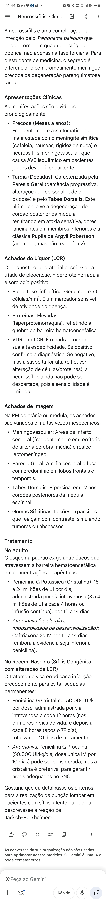
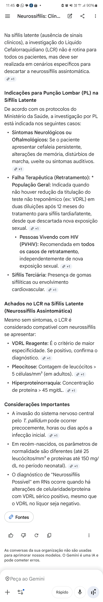

@0001

- Pupila de Argyll Robertson
LCR
- Celularidade
- VDRL = Especificidade vs Sensibilidade 
TRATAMENTO 
- 18 a 24 milhões Penicilina G Potássica/Cristalina 4-4h ou contínua por 10 a 14d
- 50.000 UI/kg 12/12 nos primeiros 7d 8/8 7-10d

