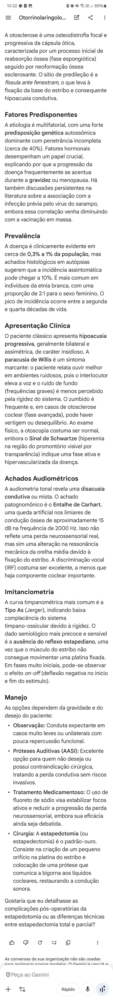
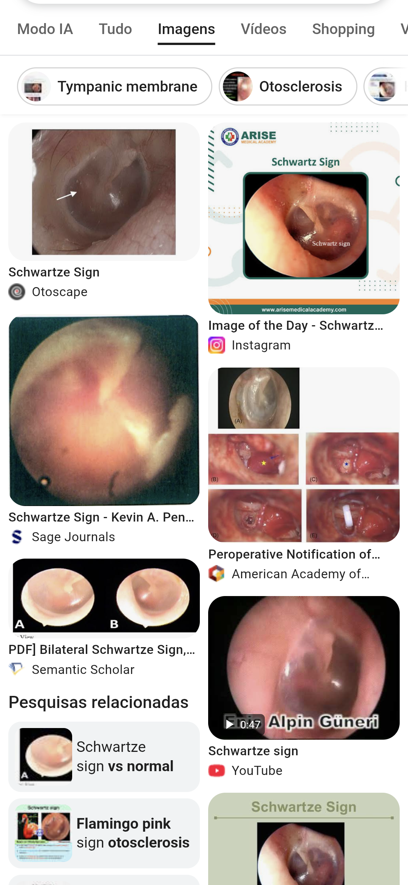

.

@0003

- Entalhe
    - de Cahart (- 15 dB em 2 kHz)
- Paracusia de Willis 
    - Escuta melhor em ambiente ruidoso
- Sinal de Schwartze
    - Hiperemia do promontório (rosa flamingo)
- Imitanciometria = Curva A* + Ausência de reflexo...
    - As
    - Estapediano
- Cirurgia + ... de sódio na fase aguda
    - Estapedectomia
    - Fluoreto de sódio 

