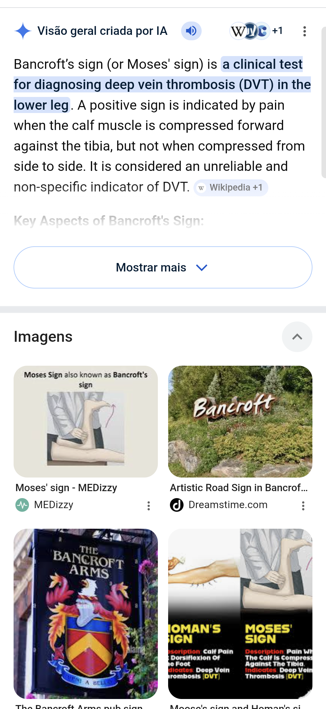

.

@0003

EXAME FÍSICO 
- Achado mais fidedigno
    - Edema unilateral > 3 cm
- Holmans, Bancrof
    - Holmans = Dor à dorsiflexao do pé 
- O que é a flegmasia cerulea dolens?
    - Obstrução maciça levando a compressão arterial
    - Indicada trombólise
- Flegmasia alba dolens = Vasoespasmo reflexo = Indica trombose maciça [distal/proximal] = Anticoagulação agressiva
    - Proximal = Risco de TEP
FLUXO DIAGNÓSTICO 
- WELLS
    - ... ou mais = USG imediato
    - Caso contrário = D-dímero
        - > 500 (ou idade x 10 se > 50a) = Positivo
- USG Ausência de compressibilidade = Positivo
    - Se suspeita ainda alta, pode repetir em 5-7 dias
PREVENÇÃO 
- PÁDUA = ... ou mais indica profilaxia 
    - 4
- CAPRINI = Pacientes [clínicos/cirúrgicos]
    - Cirúrgicos 
- ENOXA
    - 40 mg 1x = Profilática 
    - 1 mg/kg = Plena
- PREVENÇÃO MECÂNICA 
    - Sangramento ativo
    - Plaquetas < 50.000
    - Cirurgia intracraniana/oftalmo recente
    - HAS não controlada
    - FILTRO = // + Falha da anticoagulação 

